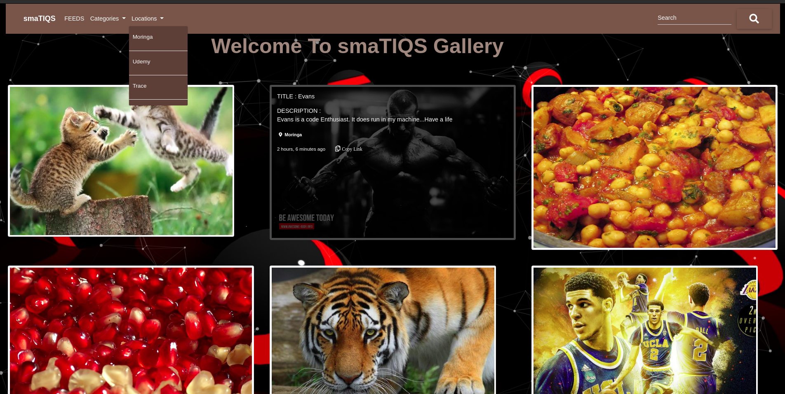

# smaTIQS
A Django generated personal gallery application that displays photos respective to there categories and locations. Offers the user a copy-url functionality.

## Author
* Evans Nyambane


### smaTIQS




## BDD
* Display image:

    - Categories

    - Locations

    - Description

* Copy image url


## Input
* Click on Categories dropdown and select category
* Click on Locations dropdown and select location
* Hover on an image
* Click on the copy icon


## Output
* Image category
* Image Location
* Image Description
* Copy image url


## Setup Requirements
  [Here's](https://www.python.org/) a brief intro about what a developer must do in order to start running the app locally:

  ```
  $ git clone https://github.com/DjCooGie/Art.git
  $ cd Art/
  ```
  * create a virtual environment
  * Activate the virtual environment
  * ` (virtual)$ pip install -r requerements.txt `
  * create your own database
  * change or add configurations in the settings.py file
  * ` (virtual)$ python3.6 manage.py makemigrations `
  * ` (virtual)$ python3.6 manage.py migrate `
  * ` python3.6 manage.py createsuperuser `

 ```
  $ python3.6 manage.py test gallery (To run tests)

 ```
 
Launch the application locally by running the command
     
  ```
  $ python3.6 manage.py runserver

  ```
  
   
## Technologies Used
  * [Python version 3.8.0](https://www.python.org/) . 
  * [Django (django modules)](https://docs.djangoproject.com/en/3.0/intro/tutorial01/).
  * PSQL database.
  * Javascript (jQuery & Particle JS)
  * Google Fonts & Icons
  * MDB Bootstrap
  * Materialize 1.0.0

 #### Bugs
No known bugs

## Site Live Link
[https://evan-smat-ups.herokuapp.com/](https://evan-smat-ups.herokuapp.com/)

#### Collaborate
>Incase of any questions, problems or ideas concerning the app, feel free to reach out to me:
>>Github: [Evans Nyambane](https://github.com/DjCooGie)
>>Email: evansonchagwa01@gmail.com

#### License
MIT
&copy;2020 Evans Nyambane


Permission is hereby granted, free of charge, to any person obtaining a copy
of this software and associated documentation files (the "Software"), to deal
in the Software without restriction, including without limitation the rights
to use, copy, modify, merge, publish, distribute, sublicense, and/or sell
copies of the Software, and to permit persons to whom the Software is
furnished to do so, subject to the following conditions:
The above copyright notice and this permission notice shall be included in all
copies or substantial portions of the Software.
THE SOFTWARE IS PROVIDED "AS IS", WITHOUT WARRANTY OF ANY KIND, EXPRESS OR
IMPLIED, INCLUDING BUT NOT LIMITED TO THE WARRANTIES OF MERCHANTABILITY,
FITNESS FOR A PARTICULAR PURPOSE AND NONINFRINGEMENT. IN NO EVENT SHALL THE
AUTHORS OR COPYRIGHT HOLDERS BE LIABLE FOR ANY CLAIM, DAMAGES OR OTHER
LIABILITY, WHETHER IN AN ACTION OF CONTRACT, TORT OR OTHERWISE, ARISING FROM,
OUT OF OR IN CONNECTION WITH THE SOFTWARE OR THE USE OR OTHER DEALINGS IN THE
SOFTWARE.


